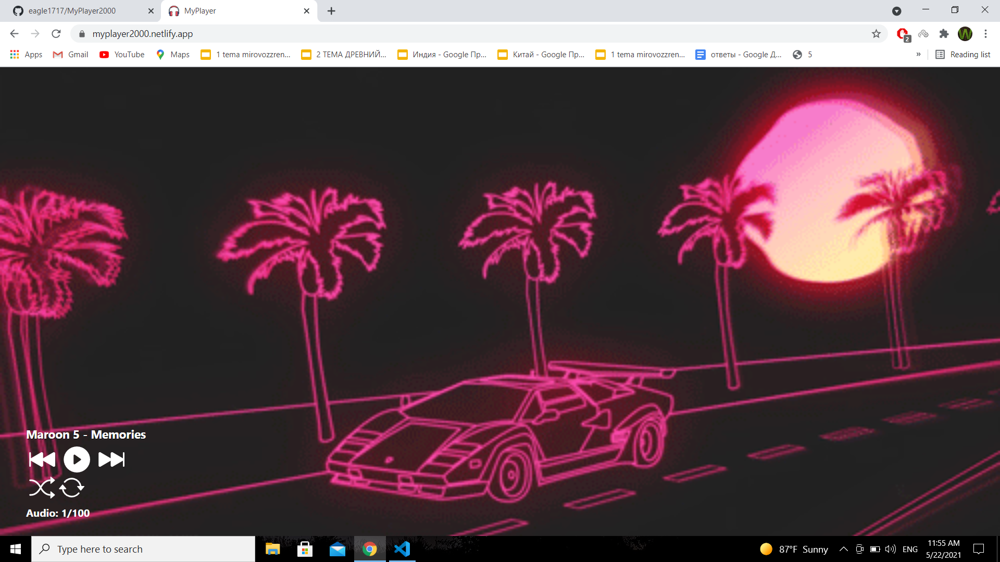
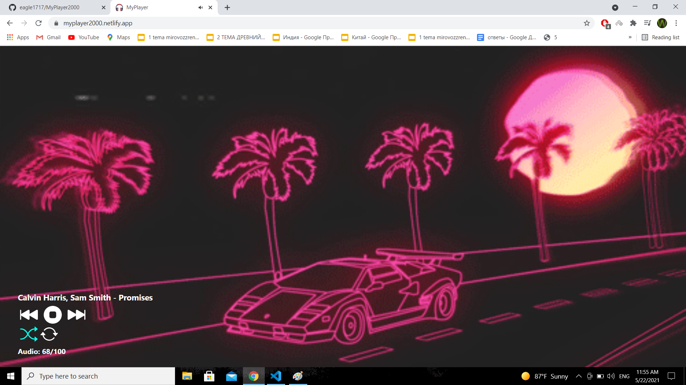
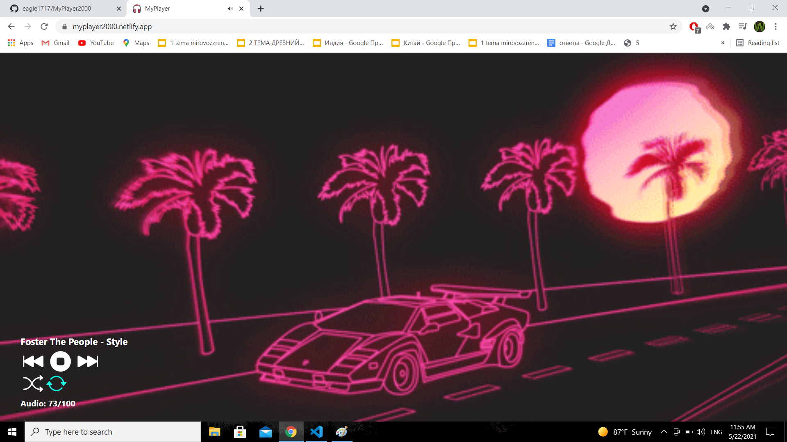

<!-- PROJECT LOGO -->
<br />
<p align="center">
  <a href="https://github.com/AIGramApp/AIGram-web">
    
  </a>

  <h3 align="center">MyPlayer2000</h3>

  <p align="center">
   My version of LofiCafe
    <br />
    <br />
    <a href="https://myplayer2000.netlify.app/">View Demo</a>
    ·
    <a href="https://github.com/eagle1717/MyPlayer2000/issues">Report Bug</a>
    ·
    <a href="https://github.com/eagle1717/MyPlayer2000/issues">Request Feature</a>
  </p>
</p>

<!-- TABLE OF CONTENTS -->

## Table of Contents

- [About the Project](#about-the-project)
  - [Built With](#built-with)
- [Getting Started](#getting-started)
  - [Prerequisites](#prerequisites)
  - [Installation](#installation)
- [Usage](#usage)
- [License](#license)
- [Acknowledgements](#acknowledgements)

<!-- ABOUT THE PROJECT -->

## About The Project





This project allows everyone to listen to music and relax.

### Built With

- [Vue.Js](https://vuejs.org/)

<!-- GETTING STARTED -->

## Getting Started

To get a local copy up and running follow these simple steps.

### Prerequisites

You only need node.js and npm to run the project.

- npm

```sh
npm install npm@latest -g
```

### Installation

1. Clone the repo

```sh
git clone https://github.com/eagle1717/MyPlayer2000.git
```

2. Install NPM packages

```sh
npm install
```

3. Run the local server:

```sh
npm run serve
```

4. After you are done with development, run for production using the following command:

```sh
npm run build
```
<!-- LICENSE -->

## License

Distributed under the MIT License. See `LICENSE` for more information.

<!-- ACKNOWLEDGEMENTS -->

## Acknowledgements

- [LofiCafe](http://lofi.cafe/) - inspiration for the project
